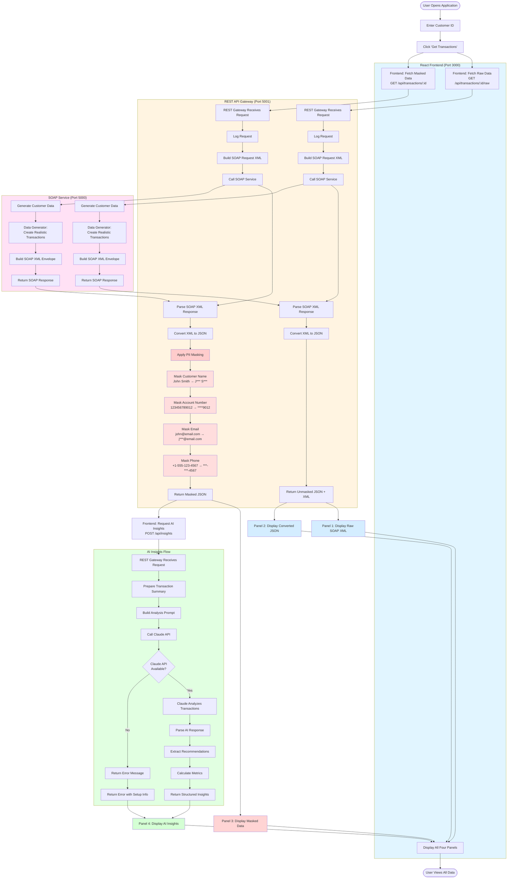
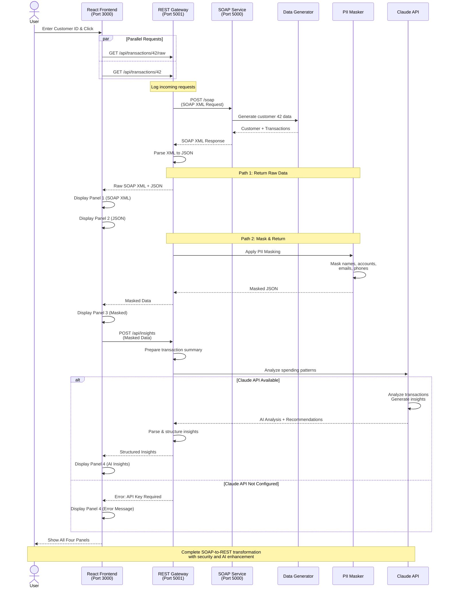

# SOAP-to-REST Transaction Viewer

A portfolio project demonstrating full-stack API transformation, data masking, and AI-powered insights.

## Architecture

```
┌─────────────────┐     ┌──────────────────┐     ┌─────────────────┐
│  React Frontend │────▶│  REST Gateway    │────▶│  SOAP Service   │
│  (Port 3000)    │◀────│  (Port 5001)     │◀────│  (Port 5000)    │
└─────────────────┘     └──────────────────┘     └─────────────────┘
         │                       │
         │                       │
         └───────────────────────┴──────────────────▶ Claude API
                                                      (AI Insights)
```

## Process Flow



### Flow Highlights

**1. Data Retrieval** (Steps 1-3)
- User enters customer ID (1-100)
- Frontend makes parallel requests for raw and masked data
- REST Gateway logs all incoming requests

**2. SOAP Transformation** (Steps 4-6)
- Gateway builds SOAP XML request envelope
- Calls legacy SOAP service with customer ID
- SOAP service generates realistic transaction data

**3. XML to JSON Conversion** (Steps 7-8)
- Gateway parses SOAP XML response
- Converts XML structure to modern JSON format
- Preserves all data for comparison

**4. PII Masking** (Steps 9-12)
- Customer names → First letter + ***
- Account numbers → Last 4 digits only (****9012)
- Email addresses → First letter + ***@domain
- Phone numbers → Last 4 digits (***-***-4567)

**5. AI Insights Generation** (Steps 13-16)
- Frontend sends masked data to insights endpoint
- Gateway prepares transaction summary for Claude
- Claude API analyzes spending patterns
- Returns structured insights and recommendations

**6. Display** (Steps 17-20)
- **Panel 1**: Raw SOAP XML (shows legacy format)
- **Panel 2**: Converted JSON (demonstrates transformation)
- **Panel 3**: Masked JSON (highlights security measures)
- **Panel 4**: AI Insights (shows value-add analysis)

### Sequence Diagram



## Features

### 1. Mock SOAP Service
- Flask-based SOAP endpoint
- Generates realistic transaction data
- Simulates legacy banking system

### 2. REST API Gateway
- Transforms SOAP XML to REST JSON
- Implements PII masking (names, account numbers)
- Request/response logging
- Simulates Azure APIM functionality

### 3. React Frontend
Four interactive panels:
1. **Raw SOAP Response** - Original XML from SOAP service
2. **Converted JSON** - Transformed REST response
3. **Masked Data** - Sanitized PII fields
4. **AI Insights** - Claude-powered spending analysis

### 4. AI Integration
- Claude API analyzes transaction patterns
- Provides spending insights and recommendations
- Demonstrates AI enhancement of legacy data

## Tech Stack

**Backend:**
- Python 3.8+
- Flask
- zeep (SOAP client/server)
- lxml (XML processing)

**Frontend:**
- React 18
- Axios (API calls)
- Tailwind CSS (styling)

**AI:**
- Anthropic Claude API

## Quick Start

### Prerequisites
- Python 3.8+
- Node.js 16+
- Claude API key (get from https://console.anthropic.com/)

### Installation

1. Clone the repository:
```bash
git clone <your-repo-url>
cd Legacy-data-simulator-
```

2. Install backend dependencies:
```bash
pip install -r requirements.txt
```

3. Install frontend dependencies:
```bash
cd frontend
npm install
cd ..
```

4. Set up environment variables:
```bash
cp .env.example .env
# Edit .env and add your CLAUDE_API_KEY
```

### Running the Application

Use the startup script to run all services:

```bash
./start.sh
```

Or run each service individually:

**Terminal 1 - SOAP Service:**
```bash
python backend/soap_service.py
```

**Terminal 2 - REST Gateway:**
```bash
python backend/rest_gateway.py
```

**Terminal 3 - React Frontend:**
```bash
cd frontend
npm start
```

### Access the Application

- Frontend: http://localhost:3000
- REST API: http://localhost:5001/api
- SOAP Service: http://localhost:5000/soap

## Usage

1. Open http://localhost:3000 in your browser
2. Enter a customer ID (1-100)
3. Click "Get Transactions"
4. View the four panels showing:
   - Raw SOAP XML response
   - Converted JSON
   - Masked PII data
   - AI-powered insights

## API Endpoints

### REST Gateway (Port 5001)

**GET /api/transactions/{customer_id}**
- Returns customer transactions in JSON format
- Automatically masks PII fields
- Logs all requests

**GET /api/transactions/{customer_id}/raw**
- Returns raw SOAP XML response
- For debugging/comparison purposes

**POST /api/insights**
- Body: `{"transactions": [...]}`
- Returns Claude API insights about spending patterns

### SOAP Service (Port 5000)

**POST /soap**
- SOAP endpoint for GetCustomerTransactions
- Accepts customer ID
- Returns XML transaction data

## Project Structure

```
Legacy-data-simulator-/
├── backend/
│   ├── soap_service.py          # Mock SOAP service
│   ├── rest_gateway.py          # REST API gateway
│   ├── data_generator.py        # Fake transaction data
│   ├── pii_masker.py            # PII masking logic
│   └── claude_client.py         # Claude API integration
├── frontend/
│   ├── public/
│   ├── src/
│   │   ├── components/
│   │   │   ├── TransactionViewer.jsx
│   │   │   ├── SoapPanel.jsx
│   │   │   ├── JsonPanel.jsx
│   │   │   ├── MaskedPanel.jsx
│   │   │   └── InsightsPanel.jsx
│   │   ├── App.js
│   │   └── index.js
│   └── package.json
├── requirements.txt
├── .env.example
├── start.sh
└── README.md
```

## Security Features

### PII Masking
The gateway automatically masks:
- Customer names (replaces with initials)
- Account numbers (shows last 4 digits only)
- Email addresses (partial masking)
- Phone numbers (partial masking)

Example:
```json
{
  "customer_name": "J*** D***",
  "account_number": "****6789",
  "email": "j***@example.com"
}
```

## Portfolio Highlights

This project demonstrates:

1. **API Integration Skills**
   - SOAP service implementation
   - REST API development
   - Protocol transformation (SOAP → REST)

2. **Security Best Practices**
   - PII data masking
   - Sensitive data handling
   - Logging and auditing

3. **Full-Stack Development**
   - Python backend services
   - React frontend
   - Multi-tier architecture

4. **AI Integration**
   - Claude API integration
   - Natural language insights
   - Data analysis enhancement

5. **DevOps Practices**
   - Multi-service orchestration
   - Environment configuration
   - Documentation

## Future Enhancements

- [ ] Add authentication/authorization
- [ ] Implement caching layer (Redis)
- [ ] Add database persistence
- [ ] Create Docker containerization
- [ ] Add unit and integration tests
- [ ] Implement rate limiting
- [ ] Add transaction filtering/search
- [ ] Export to PDF/CSV

## License

MIT License - feel free to use this for your portfolio!

## Author

Built as a portfolio demonstration project showcasing modern API transformation and AI integration techniques.
